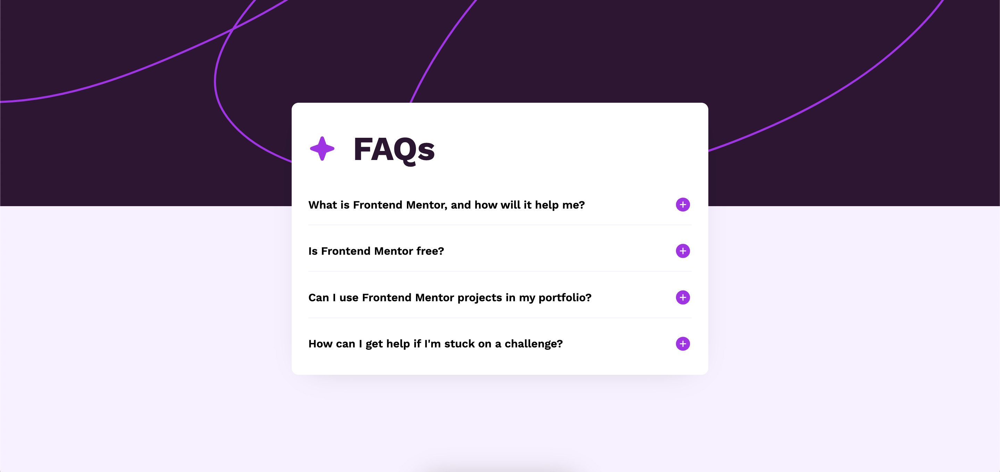
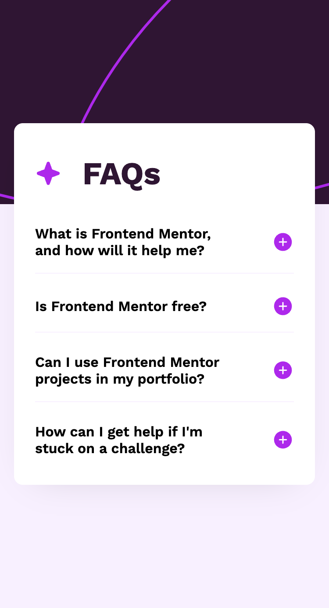

# FAQ Accordion 

A responsive FAQ accordion. This page was built as a front-end project of [Frontend Mentor](https://www.frontendmentor.io/challenges/faq-accordion-wyfFdeBwBz/).

- [Page](https://norwyx.github.io/faq-accordion/) - Final result of the project

## Built with
- [HTML5](https://developer.mozilla.org/es/docs/Web/HTML)
- [CSS3](https://developer.mozilla.org/es/docs/Web/CSS)
- [JavaScript](https://developer.mozilla.org/es/docs/Web/JavaScript)
- [Github Pages](https://pages.github.com/)